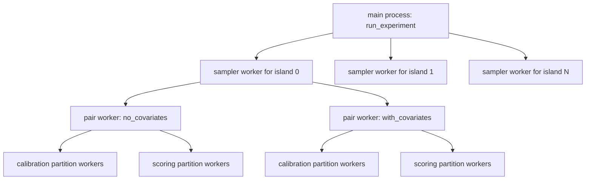

# Parallelism and Worker Spawning in the FunSearch Pipeline

This document describes where processes are spawned in the current FunSearch priority-function pipeline, what each worker does, and which parts are configurable.

The three process-spawning layers are:

1. sampler workers, spawned once per island shard during each outer cycle
2. evaluator pair workers, spawned once per prepared dataset pair during one candidate evaluation
3. calibration/scoring partition workers, spawned inside one pair evaluation to split subject rows across processes

These layers are nested. A sampler worker can evaluate one candidate. That candidate evaluation can spawn pair workers. Each pair worker can then spawn calibration workers and later scoring workers.

## High-level execution tree

For a normal `procedure2` run, the execution shape is:



The important consequence is that there is more than one place where concurrency is introduced. If all settings are high, the process count can grow quickly.

## Layer 1: sampler workers

### Where they are spawned

The outer runner creates one sampler request per island shard and executes them in parallel in:

- [funsearch_pipeline/orchestration/runner.py](funsearch_pipeline/orchestration/runner.py#L137)

The worker entrypoint is:

- [funsearch_pipeline/sampling/island_sampler.py](funsearch_pipeline/sampling/island_sampler.py#L181)

### What one sampler worker does

One sampler worker owns one island shard for one cycle. Inside that worker, it:

1. builds prompts for that island
2. calls the configured sampler backend
3. validates the returned priority function
4. evaluates the candidate
5. registers accepted candidates into the local shard

That means the sampler worker is not just generating text. It also performs evaluation work, and that evaluation can spawn more processes underneath it.

### How many sampler workers are spawned

This is controlled by:

- `sampler.parallel_workers`

The effective sampler-worker count is:

$$
\min(\text{num\_islands},\ \text{sampler.parallel\_workers})
$$

because the runner builds one request per island, but the `ProcessPoolExecutor` is capped at `parallel_workers`.

Relevant config documentation already exists in:

- [Documentation/funsearch_pipeline.example.json](Documentation/funsearch_pipeline.example.json#L25)
- [Documentation/funsearch_pipeline.example.json](Documentation/funsearch_pipeline.example.json#L41)

## Layer 2: evaluator pair workers

### Where they are spawned

When a candidate priority function is evaluated under the `procedure2` evaluator, the evaluator can score multiple dataset pairs in parallel in:

- [funsearch_pipeline/evaluation/procedure2.py](funsearch_pipeline/evaluation/procedure2.py#L362)

The pair-worker function is:

- [funsearch_pipeline/evaluation/procedure2.py](funsearch_pipeline/evaluation/procedure2.py#L371)

### What one pair worker does

One pair worker handles one prepared dataset pair, for example:

1. `no_covariates`
2. `with_covariates`

Inside that worker, it:

1. loads `oracle_train.pkl`
2. iterates over the prepared fold-specific `calibration_i.pkl` and `scoring_i.pkl` artifacts for that pair
3. builds the oracle feature matrix for calibration
4. fits the ridge calibration model
5. builds the oracle feature matrix for scoring
6. computes AUC and bootstrap statistics

### How many pair workers are spawned

This is currently driven by the number of prepared dataset pairs, not by a dedicated config field.

The effective pair-worker count per candidate evaluation is:

$$
\text{num\_pair\_workers} =
\begin{cases}
1 & \text{if number of dataset pairs} \le 1 \\
\text{number of dataset pairs} & \text{otherwise}
\end{cases}
$$

So with the current sample config, which defines two pairs, the evaluator spawns two pair workers per candidate evaluation. Each of those workers then processes all configured folds for its pair sequentially while reusing the prepared artifacts written on the first `prepare(...)` call.

### Can this be controlled through the config?

Not directly.

At the moment there is no separate config key such as `evaluator.pair_parallel_workers` or `evaluator.max_pair_workers`.

The only current ways to reduce pair-level parallelism are:

1. reduce the number of configured `dataset_pairs`
2. change code so pair-worker fanout is capped by a new config field

If you want pair-level control without removing pairs, the code would need a small change.

## Layer 3: calibration partition workers

### Where they are spawned

Calibration feature-matrix construction fans out through:

- [funsearch_pipeline/evaluation/procedure2.py](funsearch_pipeline/evaluation/procedure2.py#L418)
- [funsearch_pipeline/evaluation/procedure2.py](funsearch_pipeline/evaluation/procedure2.py#L774)
- [funsearch_pipeline/evaluation/procedure2.py](funsearch_pipeline/evaluation/procedure2.py#L894)

The shared partition-worker function is:

- [funsearch_pipeline/evaluation/procedure2.py](funsearch_pipeline/evaluation/procedure2.py#L930)

### What they do

These workers split the calibration subjects into row chunks. Each worker computes oracle-derived features for its own chunk.

For each subject and each variant in that chunk, the worker:

1. calls the priority function to get a radius
2. calls `effect_size_calculator(...)`
3. multiplies dosage by estimated effect size
4. writes one block of the calibration oracle feature matrix

### How many calibration workers are spawned

This is controlled by:

- `evaluator.calibration_partitions`

The actual worker count is:

$$
\min(\text{evaluator.calibration\_partitions},\ \text{number of calibration subjects})
$$

If `calibration_partitions` is `1`, no child processes are spawned for that step. The work stays inline in the pair worker.

## Layer 4: scoring partition workers

### Where they are spawned

Scoring uses the same partitioning helper, but the controlling call path is:

- [funsearch_pipeline/evaluation/procedure2.py](funsearch_pipeline/evaluation/procedure2.py#L441)
- [funsearch_pipeline/evaluation/procedure2.py](funsearch_pipeline/evaluation/procedure2.py#L916)
- [funsearch_pipeline/evaluation/procedure2.py](funsearch_pipeline/evaluation/procedure2.py#L894)

### What they do

These workers split the scoring subjects into row chunks and build the scoring oracle feature matrix in parallel.

Like calibration workers, they do the expensive per-subject, per-variant oracle calls.

### How many scoring workers are spawned

This is controlled by:

- `evaluator.scoring_partitions`

The actual worker count is:

$$
\min(\text{evaluator.scoring\_partitions},\ \text{number of scoring subjects})
$$

If `scoring_partitions` is `1`, no child processes are spawned for that step.

## What is configurable today

The current config knobs that affect process fanout are:

1. `program_database.num_islands`
2. `sampler.parallel_workers`
3. `evaluator.calibration_partitions`
4. `evaluator.scoring_partitions`
5. indirectly, the number of `evaluator.dataset_pairs`

In plain terms:

- `sampler.parallel_workers` controls how many island sampler processes run at once
- `calibration_partitions` controls how many workers build calibration features for one pair
- `scoring_partitions` controls how many workers build scoring features for one pair
- the number of dataset pairs controls how many pair workers the evaluator spawns, but there is no separate cap for that layer today

## Does config control the number of workers during calibration and scoring?

Yes.

For calibration, use:

```json
"calibration_partitions": 4
```

For scoring, use:

```json
"scoring_partitions": 4
```

Set either value to `1` to disable multiprocessing for that stage.

What config does not currently control is the pair-worker layer. If two dataset pairs are configured, the evaluator will spawn two pair workers.

## Important nesting behavior

The current design allows nested process pools.

For example, suppose you use:

- `sampler.parallel_workers = 8`
- `dataset_pairs = 2`
- `calibration_partitions = 4`
- `scoring_partitions = 4`

Then each active sampler worker can evaluate a candidate by:

1. spawning up to 2 pair workers
2. each pair worker spawning up to 4 calibration workers
3. later, each pair worker spawning up to 4 scoring workers

Calibration and scoring partitions for one pair are sequential, not simultaneous. Scoring starts after calibration finishes for that pair. But pair workers can run concurrently with each other, and multiple sampler workers can also be active at the same time.

That means the total number of live Python processes can still become fairly large.

## Practical guidance

If you want conservative resource usage, the safest first settings are:

```json
"parallel_workers": 1,
"calibration_partitions": 1,
"scoring_partitions": 1
```

Then scale upward one layer at a time.

For example:

1. first increase `sampler.parallel_workers`
2. then increase `scoring_partitions`
3. then increase `calibration_partitions`

This makes it easier to understand which layer is saturating CPUs or memory.

## Current limitations

The current code does not expose config fields for:

1. maximum pair-worker count per candidate evaluation
2. a single global process budget across all nested worker layers
3. explicit CPU pinning or affinity control

The logs do record observed CPU placement for sampler workers and pair workers, but scheduling is left to the OS.

## Summary

Today, the answer to the config question is:

1. yes, calibration worker count is controlled by `evaluator.calibration_partitions`
2. yes, scoring worker count is controlled by `evaluator.scoring_partitions`
3. no, pair-worker count is not separately configurable today
4. yes, island sampler concurrency is controlled by `sampler.parallel_workers`

If you want, the next sensible code change would be to add something like `evaluator.pair_parallel_workers` so the pair-worker layer can be capped independently of the number of configured dataset pairs.